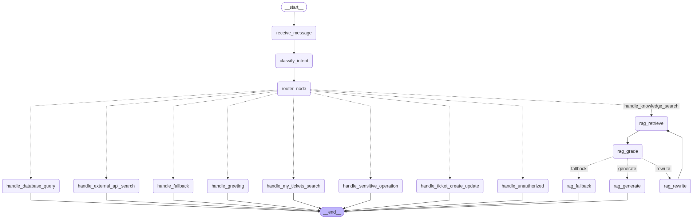
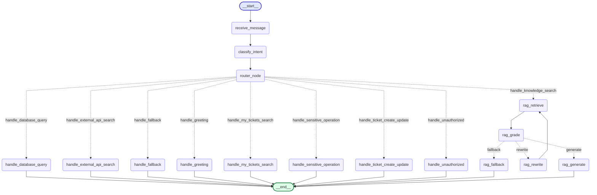

# 04 - المخطط المعماري الكامل للـ LangGraph ومسار التنفيذ
## (Enterprise LangGraph Architecture, Visual Flow & RBAC Intents)

---

## 1. مخطط الجراف الكامل (Mermaid Architecture Diagram)

هذا هو المخطط البياني البرمجي الكامل والمستخرج مباشرة من محرك `enterprise_agent_graph` بعد ربط المرحلة الأولى والثانية:

---

## 2. جدول النوايا الثمانية ومصفوفة الصلاحيات (The 8 Supported Intents & RBAC Matrix)

| # | النية (Intent) | الوصف والمعنى | الأدوار المصرح لها (Authorized Roles) | أمثلة توضيحية |
| :--- | :--- | :--- | :--- | :--- |
| **1** | `greeting` | التحيات، الترحيب، والاستفسار عن هوية المساعد | **الجميع** (Customer, Support Agent, Senior Agent, Admin) | "Hello, good morning", "السلام عليكم", "Hi, who are you?" |
| **2** | `knowledge_search` | البحث عن سياسات الشركة، أدلة الـ VPN، الواي فاي، كلمات المرور | **الجميع** (Customer, Support Agent, Senior Agent, Admin) | "How to configure VPN on MacOS?", "كود الخطأ 0x80070005", "شروط باسوورد الموظفين" |
| **3** | `my_tickets_search` | الاستعلام عن حالة التذاكر السابقة الخاصة بنفس الموظف | **الجميع** (كل مستخدم لتذاكره الخاصة فقط) | "Check status of my ticket #1042", "وريني تذاكري المفتوحة" |
| **4** | `ticket_create_update` | إنشاء تذكرة دعم فني جديدة أو تعديل أولوية تذكرة قائمة | **Support Agent, Senior Agent, Admin** *(محظور على العميل العادي)* | "Create a new support ticket for email outage", "Update ticket #44 priority to high" |
| **5** | `external_api_search` | الاستعلام من خدمات وواجهات خارجية (Stripe, GitHub, Cloud APIs) | **Support Agent, Senior Agent, Admin** *(محظور على العميل العادي)* | "Query external API for Stripe payment status", "Check GitHub API incident status" |
| **6** | `sensitive_operation` | عمليات عالية الخطورة (تغيير باسوورد مستخدم، ترقية صلاحيات، ريبوت سيرفر) | **Senior Agent, Admin** *(محظور على Customer و Support Agent)* | "Reset password for user John", "Elevate permissions to superuser", "Reboot staging server" |
| **7** | `database_query_operation` | استعلامات SQL المباشرة، فحص الجداول، التعديل على قاعدة البيانات | **Admin فقط** *(محظور على كافة الأدوار الأخرى)* | "Run SQL query on users table", "Select * from audit_logs", "Drop table logs" |
| **8** | `out_of_scope` | أسئلة عامة أو ترفيهية لا علاقة لها بالدعم الفني المؤسسي | **يتم توجيهه لعقدة الاعتذار (Fallback)** | "What is the weather in Tokyo?", "قولي نكتة", "ما هي عاصمة إيطاليا؟" |

---

## 3. كيف يعمل مصنف النوايا (Intent Classifier) بالتفصيل؟

المصنف يعمل عبر **نظام هجين ذكي ثنائي الطبقات (Dual-Layer Robust Architecture)** يضمن دقة خيالية وعدم سقوط السيرفر نهائياً:

### الطبقة الأولى: التصنيف بنموذج الذكاء الاصطناعي مع الـ Structured Output
1. يستلم الموديل (Qwen 2.5 72B عبر OpenRouter أو Aurai-3.0) رسالة المستخدم بالإضافة إلى `CLASSIFIER_SYSTEM_PROMPT` في ملف `classifier_prompt.py`.
2. بدلاً من أن يجيب بنص حر، يتم إجباره برمجياً عبر تقنية **`with_structured_output`** على إرجاع كائن Pydantic مضبوط بالمللي (`IntentClassificationOutput`):
   - `intent`: واحدة من النوايا الثمانية المعتمدة فقط.
   - `confidence`: رقم عشري من 0.0 إلى 1.0 يمثل نسبة التأكد.
   - `reasoning`: سطر يشرح سبب اختياره لهذه النية.
   - `extracted_entities`: الكيانات المستخرجة (رقم التذكرة، اسم المستخدم، اسم السيرفر).

### الطبقة الثانية: صمام الأمان الحتمي (Deterministic Fallback)
لو حدث انقطاع في الإنترنت، أو أرجع مزود الـ LLM خطأ 429 (Rate Limit) أو 500:
1. الـ Try/Except يلتقط الخطأ فوراً في `classify_node.py`.
2. يتم تشغيل الدالة الحتمية `classify_intent_fallback` في `llm_service.py`.
3. الدالة تفحص الكلمات المفتاحية باللغتين (العربية والإنجليزية) ومطابقة التعبيرات القياسية (Regex) وتحدد النية الصحيحة فوراً بدون تأخير وبدون توقف السيرفر!
