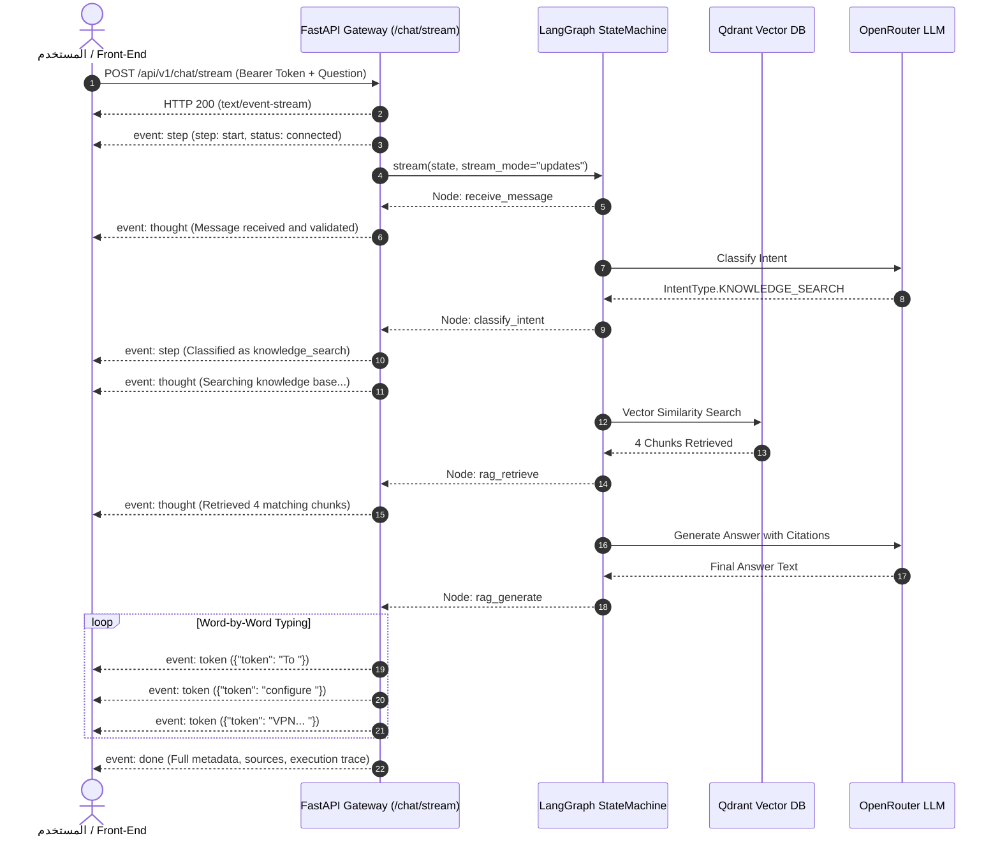

# الدليل التفصيلي للمرحلة السابعة (Phase 7): البث اللحظي للتوكنز وأفكار الوكيل الذكي (Real-Time Token & Thought Streaming عبر Server-Sent Events)

---

## 1. مقدمة وهدف المرحلة

في المراحل السابقة، كانت كل طلبات المحادثة تمر عبر نقطة النهاية المعتادة:
`POST /api/v1/chat`
وهي نقطة نهاية **متزامنة تقليدية (Request-Response)**؛ المستخدم يرسل السؤال، وينتظر 2 إلى 5 ثوانٍ كاملة حتى ينتهي الـ Agent من التفكير والبحث في Qdrant وتقييم الـ CRAG وتوليد الرد بالكامل، ثم يستلم الرد دفعة واحدة في هيئة كائن JSON كبير.

### لماذا يعتبر الـ Streaming معياراً إجبارياً في أنظمة الـ Enterprise الحديثة؟
1. **تقليل زمن الاستجابة المحسوس (Time-To-First-Token - TTFT):**
   * بدلاً من الانتظار 4 ثوانٍ، يستلم المستخدم أول حدث وأول توكن في أقل من **300 إلى 500 ميلي ثانية**، مما يمنحه إحساساً فورياً بالسرعة.
2. **شفافية تفكير الوكيل الذكي (Agent Explainability & Observability):**
   * المستخدم يرى خطوات تفكير الـ Agent لحظياً أمامه في واجهة الشات:
     * *"🔍 جاري البحث في قاعدة المعرفة..."*
     * *"⚖️ جاري تقييم دقة وصلاحية المستندات المسترجعة..."*
     * *"✍️ جاري صياغة الرد المدعوم بالمصادر..."*
3. **تجربة مستخدم شبيهة بـ ChatGPT (Typewriter Effect):**
   * طباعة الكلمات كلمة بكلمة بشكل حي وسلس.

---

## 2. معمارية الـ Server-Sent Events (SSE)

اخترنا **Server-Sent Events (SSE)** بدلاً من WebSockets لعدة أسباب مؤسسية:
* **البساطة والتوافق:** تعمل عبر بروتوكول HTTP القياسي بدون الحاجة لـ Upgrade Headers أو مشاكل مع الـ Corporate Firewalls والـ Proxies.
* **أحادية الاتجاه (Uni-directional):** العميل يرسل الرسالة مرة واحدة، والسيرفر يبث تياراً من الأحداث المتتالية حتى يكتمل الرد.
* **إعادة الاتصال التلقائي (Native Reconnection):** المتصفحات تدعم SSE أصلياً عبر واجهة `EventSource`.



---

## 3. بروتوكول الأحداث (SSE Event Types)

تبث الـ Endpoint `POST /api/v1/chat/stream` الأحداث التالية بالترتيب:

### 1) حدث الخطوة `event: step`
يُرسل عند بداية وانتهاء كل Node داخل الـ StateGraph:
```http
event: step
data: {"node": "classify_intent", "status": "completed", "thought": "Classified intent as 'knowledge_search'.", "intent": "knowledge_search", "is_authorized": true}
```

### 2) حدث التفكير `event: thought`
يُرسل لتحديث شريط الحالة أو فقاعة التفكير (Thinking Bubble) في واجهة المستخدم:
```http
event: thought
data: {"thought": "Grading relevance of retrieved documents..."}
```

### 3) حدث التوكن `event: token`
يُرسل أجزاء الكلمات والتوكنز المتتالية لرسمها على الشاشة بتأثير الكتابة اللحظية:
```http
event: token
data: {"token": "OpenConnect "}
```

### 4) حدث المقاطعة البشرية `event: interrupt`
إذا وصل الـ Agent لعملية حساسة (Sensitive Operation) وتوقف عندها:
```http
event: interrupt
data: {"approval_required": true, "thread_id": "stream_hitl_01", "status": "PENDING_SUPERVISOR_APPROVAL", "details": {"operation": "Reset password for user John"}}
```

### 5) حدث الانتهاء `event: done`
يُرسل في نهاية الجلسة متضمناً الحالة النهائية الشاملة والمصادر المسترجعة:
```http
event: done
data: {"final_response": "...", "intent": "knowledge_search", "is_authorized": true, "thread_id": "stream_demo_01", "sources": ["vpn_access_policy.md"]}
```

---

## 4. كيفية الاختبار والاستهلاك (Testing & Consumption)

### عبر cURL من التيرمينال:
```bash
curl -N -X POST http://localhost:8000/api/v1/chat/stream \
  -H "Authorization: Bearer <YOUR_JWT_TOKEN>" \
  -H "Content-Type: application/json" \
  -H "Accept: text/event-stream" \
  -d '{"message": "How do I configure VPN?", "thread_id": "stream_test_01"}'
```
*(ملاحظة: العلم `-N` في cURL يمنع الـ Buffering ويطبع التوكنز لحظياً فور وصولها).*

### عبر كولكشن Postman:
* تم إضافة مجلد كامل وجاهز:
  **`11 - Real-Time Streaming (Phase 7)`**
  يحتوي على سيناريوهات الترحيب، والـ RAG، والـ HITL Interrupt، والرفض الصلاحياتي (RBAC).

---

## 5. ملخص نتائج الاختبارات الآلية

تم اختبار نقطة النهاية عبر حزمة اختبارات تكاملية شاملة في [`tests/integration/test_phase7_streaming.py`](file:///d:/ldc-Langgraph/tests/integration/test_phase7_streaming.py):
- ✅ `test_stream_endpoint_invalid_token_returns_401`: رفض التوكن التالف بـ 401 Unauthorized.
- ✅ `test_stream_endpoint_unauthenticated_guest_allowed`: السماح بالزائر المجهول كـ Customer.
- ✅ `test_stream_greeting_emits_valid_sse_events`: بث أحداث step و thought و token و done.
- ✅ `test_stream_customer_rbac_denial_emits_unauthorized_event`: بث رسالة الرفض 403 عند محاولة SQL.
- ✅ `test_stream_hitl_interrupt_emits_interrupt_event`: بث حدث `interrupt` عند العمليات الحساسة.
- ✅ `test_stream_knowledge_search_rag_pipeline`: بث خطوات الـ RAG والمصادر المسترجعة.
